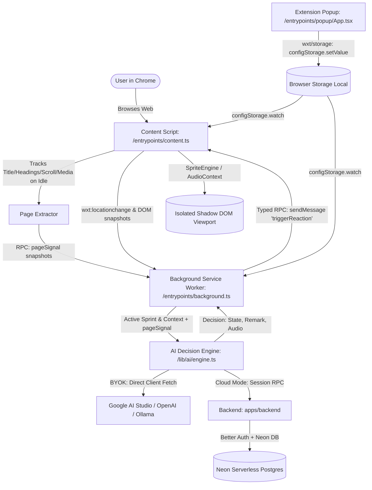

# Gremlin — Technical Architecture & Developer Handbook

> Comprehensive architectural reference for Gremlin, designed for engineers and autonomous AI coding agents working on the codebase.

---

## 1. System Overview & Monorepo Topology

Gremlin is built as a TypeScript Turborepo monorepo structured into 4 packages/apps:

```
gremlin/
├── apps/
│   ├── extension/       # Chrome Manifest V3 Extension (WXT + React 19 + Tailwind v4)
│   ├── web/             # Marketing, Docs & Cloud Dashboard (Vite + React 19 + Tailwind + Three.js)
│   └── backend/         # Edge REST API & AI Gateway (Hono + Better Auth + Cloudflare Workers + Neon)
├── packages/
│   └── shared/          # Shared TypeScript interfaces, Zod schemas & AI prompt types
└── docs/
    └── ARCHITECTURE.md  # System specification and development handbook (this document)
```

### High-Level Data Flow



---

## 2. Browser Extension Architecture (`apps/extension`)

### Core Principles
1. **Manifest V3 Native Lifecycle:** Powered by [WXT (Next-gen Web Extension Framework)](https://wxt.dev).
2. **Shadow DOM Isolation:** The companion widget is injected into an isolated Shadow DOM (`gremlin-organism-viewport`) via `createShadowRootUi(ctx)`. Webpage styles and CSS frameworks cannot pollute or break the companion UI.
3. **Reactive State Synchronization (`wxt/storage`):**
   - Uses `storage.defineItem` wrappers (`configStorage`, `sprintStorage`, `organismStateStorage`, `activityStorage`).
   - Content scripts use `configStorage.watch()` to reactively update the companion avatar, audio volume, and dock position in real time across **all open browser tabs** without requiring a page refresh.
4. **Retroactive Script Injection:**
   - On install or extension reload, `browser.runtime.onInstalled` in `background.ts` queries all open HTTP/HTTPS tabs and executes `browser.scripting.executeScript` to inject `/content-scripts/content.js` dynamically.
5. **Zero-Leak Lifecycle Invalidation:**
   - Content scripts listen to `ctx.onInvalidated()`. When the extension is uninstalled or disabled in Chrome, all `requestAnimationFrame` loops, audio contexts, and injected DOM nodes are purged immediately.

### Key Directories & Files
* `entrypoints/content.ts`: Mounts the Shadow DOM container, handles SPA `wxt:locationchange` events, manages the active `OrganismController`, and relays privacy-filtered page snapshots to the service worker.
* `entrypoints/background.ts`: Service worker tracking tab switches (`tabs.onActivated`, `tabs.onUpdated`), running debounced + throttled evaluation alarms (45s minimum interval between LLM calls; manual pokes bypass), and handling typed RPC messages including inbound `pageSignal` deliveries.
* `entrypoints/popup/App.tsx`: Retro handheld console interface for goal entry, companion selection carousel, BYOK model configuration, and audio toggles.
* `lib/organism/controller.ts`: Coordinates coordinate math, drag physics, sprite render loops, and thought pill speech bubbles.
* `lib/organism/spriteEngine.ts`: Standalone, procedural Canvas2D pixel animator supporting idle, peek, surprised, annoyed, sleeping, and celebrating states.
* `lib/audio/soundEngine.ts`: Pure Web Audio API procedural synthesizer for Animalese speech chirps, alert beeps, and start/finish chimes with zero external audio assets.
* `lib/events/tracker.ts` & `extractor.ts`: The extractor captures page titles, meta tags, headings, article snippets, scroll depth, and HTML5 media state using `requestIdleCallback`; content scripts push snapshots to the background via the typed `pageSignal` RPC. The tracker keys signals by domain (TTL 15 min, capacity 30) and exposes the fresh signal for the current domain inside `BrowserContext.pageSignal`, where it feeds real page context (headings/excerpt/media/scroll) into both cloud and BYOK AI evaluation breadcrumbs.
* `lib/storage/index.ts`: All persisted state defined via `storage.defineItem` with `fallback` defaults; imports flow through WXT's canonical `#imports`.
* Unit tests live beside sources (`*.test.ts`) and run on the `WxtVitest()` plugin with `fakeBrowser` (`pnpm --filter @gremlin/extension test`).

---

## 3. Backend & Cloud Architecture (`apps/backend`)

### Tech Stack
* **Framework:** [Hono v4](https://hono.dev) deployed on **Cloudflare Workers**.
* **Database:** [Neon Serverless Postgres](https://neon.tech) via `@neondatabase/serverless` (single memoized pool shared by Better Auth and sprint persistence).
* **Authentication:** [Better Auth](https://better-auth.com) with email/password and session cookies configured for browser extensions (`chrome-extension://` origins via env-driven allowlists).
  * `session.cookieCache` (5 min signed cookie) avoids a Postgres round trip on every service-worker wake-up.
  * Rate limiting persists in the `rate_limit` table (`storage: 'database'`) — in-memory counters are meaningless across isolates.
  * Client IP resolution uses `cf-connecting-ip`.
  * Plan tier (`free`/`pro`) lives on `user.additionalFields.plan` with `input: false` so it can only be mutated server-side (billing webhooks/admins).
* **AI Ingestion:** [Vercel AI SDK v7](https://sdk.vercel.ai) (`@ai-sdk/google`, `@ai-sdk/openai`, `@ai-sdk/anthropic`, `@ai-sdk/groq`). Structured output uses `generateText` + `Output.object({ schema })` (`generateObject` is deprecated). **Zero Fallbacks:** an unconfigured or failing provider surfaces an honest `503` error envelope instead of faking an `on_task` result.

### Cloud API Routes
* `GET /health`: Health check and status ping.
* `ALL /api/auth/*`: Better Auth handler (sign-up, sign-in, sign-out, session validation).
* `GET /api/user/profile`: Authenticated profile incl. plan tier. `PATCH /api/user/profile`: display-name update.
* `POST /api/sprint/evaluate`: Authenticated cloud proxy for AI reasoning (for Pro subscribers without their own API keys). Request body validated with `@hono/zod-validator`; error envelopes are typed into `hc<AppType>` responses via hono's `ApplyGlobalResponse`.
* `POST /api/sprint/start` / `GET /api/sprint/current` / `POST /api/sprint/complete`: Cross-device sprint lifecycle persisted in Neon (`sprints` table) — state survives worker eviction, unlike the previous per-isolate in-memory Map.

### Origin Configuration
CORS and Better Auth `trustedOrigins` share one allowlist builder fed by worker bindings:
* `ALLOWED_EXTENSION_IDS` — comma-separated Chrome extension IDs (become `chrome-extension://<id>` entries). Required in production.
* `ALLOWED_ORIGINS` — extra exact web origins.
* Outside production (`NODE_ENV !== 'production'`), localhost any-port and a permissive `chrome-extension://*` wildcard are tolerated for local development.

---

## 4. Web Application & Landing Page (`apps/web`)

### Tech Stack
* **Framework:** React 19 + Vite 6 + Tailwind CSS v4.
* **3D Mascot:** Three.js procedural voxel turntable for companion 001 ("Kuro").
* **Interactive Simulations:**
  - `InteractiveComparisonSim.tsx`: Live interactive simulation contrasting rigid domain blockers vs Gremlin context-aware AI.
  - `InteractiveBento.tsx`: Mouse-spotlight interactive cards highlighting local privacy, procedural audio, and multi-device synchronization.
* **Pages:**
  - `/`: Clean, high-converting landing page with scannable micro-copy.
  - `/pricing`: Tier breakdown (Free BYOK, $5/mo Pro, $49 Founder Pass) and FAQ.
  - `/auth`: Sign in / sign up portal for Gremlin Cloud.
  - `/privacy` & `/terms`: Full compliance and security disclosures for Chrome Web Store review.

---

## 5. Monetization & Payment Processing Architecture

### Model Strategy

| Tier | Price | Who It's For | Tech Flow |
| :--- | :--- | :--- | :--- |
| **Free BYOK** | **$0 forever** | Developers & power users who bring their own API keys (Google Gemini, OpenAI, Claude, Groq, Ollama). | Direct client-side fetch from extension service worker. $0 server/LLM cost to us. |
| **Gremlin Pro** | **$5 / month** | Non-technical users, students, and professionals wanting 1-click zero-setup focus coaching. | Subscription via Stripe / Lemon Squeezy / Polar. Edge AI proxy on Cloudflare Workers. |
| **Founder Pass** | **$49 one-time** | Early supporters wanting lifetime cloud access + exclusive companion skins. | One-time checkout with permanent flag in Neon `user` table. |

### Stripe / Polar Integration Blueprint
1. Set up a Webhook route in `apps/backend/src/routes/billing.ts` listening for `checkout.session.completed` and `customer.subscription.deleted`.
2. When a user completes checkout, update `user.tier = 'pro'` in the Neon Postgres database.
3. Extension checks `/api/auth/get-session` on launch. If `user.tier === 'pro'`, the extension operates in managed cloud mode without requesting an API key.

---

## 6. Chrome Web Store Publishing Checklist

1. **Build Production Extension:**
   ```bash
   pnpm --filter @gremlin/extension build
   ```
   This generates the optimized production bundle in `apps/extension/.output/chrome-mv3`.
2. **Zip the Output:**
   ```bash
   pnpm --filter @gremlin/extension zip
   ```
   Produces `.output/<name>-<version>-chrome.zip` with `manifest.json` at the zip root.
3. **Automated Submission (WXT native):**
   WXT ships store automation — run `pnpm --filter @gremlin/extension submit:init` once to generate
   `.env.submit` (Chrome uses the CWS Publish API OAuth flow), then release new versions with:
   ```bash
   pnpm --filter @gremlin/extension submit          # add --dry-run to verify secrets first
   ```
   Required env/secrets: `CHROME_EXTENSION_ID`, `CHROME_CLIENT_ID`, `CHROME_CLIENT_SECRET`, `CHROME_REFRESH_TOKEN`.
4. **Chrome Web Store Developer Dashboard:**
   - Upload `gremlin-extension.zip`.
   - **Permissions Justification:**
     - `storage`: Save local user preferences and focus goals.
     - `tabs`: Read active tab title/URL during active sprints to detect distractions.
     - `alarms`: Periodic background check for active focus sprints.
     - `scripting`: Inject content scripts on open tabs upon install.
   - **Single Purpose Description:** "AI-powered desk companion that coaches your focus during sprints without rigid website blacklists."
   - **Privacy Policy:** Live at `https://gremlin.fasihi.xyz/privacy` (SPA rewrite via apps/web/vercel.json).
